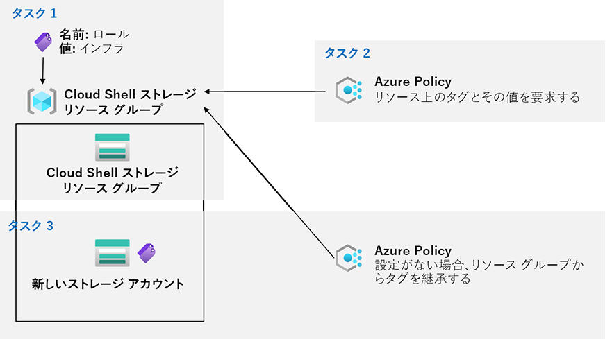

---
lab:
    title: '02b - Azure Policy を介してガバナンスを管理する'
    module: 'モジュール 02 - ガバナンスとコンプライアンス'
---

# ラボ 02b - Azure Policy を介してガバナンスを管理する
# 受講生用ラボ マニュアル

## ラボ シナリオ

Contoso の Azure リソースの管理を強化するために、次の機能を実装する任務を負いました。

- Cloud Shell ストレージ アカウントなどインフラストラクチャ リソースのみを含むリソース グループにタグを付ける

- 適切にタグ付けされたインフラストラクチャ リソースのみを、インフラストラクチャ リソース グループに追加できるようにする

- 非準拠リソースを修復する 

## 目標

このラボでは次の内容を学習します。

+ タスク 1: Azure portal を介して タグを作成し、割り当てる
+ タスク 2: Azure Policy を使用してタグ付けを強制する
+ タスク 3: Azure Policy を使用してタグ付けを適用する

## 予想時間: 30 分

## アーキテクチャの図



## 手順

### 演習 1

#### タスク 1: Azure portal を使用してタグを割り当てる

このタスクでは、Azure portal を介してタグを作成し、Azure リソース グループに割り当てます。

1. Azure portal 内の **「Cloud Shell」** で **PowerShell** セッションを開始します。

    >**注**: **Cloud Shell** の初回起動時に **「ストレージがマウントされていません」** というメッセージが表示された場合は、このラボで使用しているサブスクリプションを選択し、**「ストレージの作成」** を選択します。 

1. 「Cloud Shell」 ウィンドウで次のコマンドを実行し、Cloud Shell で使用されるストレージ アカウントの名前を確認します。

   ```powershell
   df
   ```

1. コマンドの出力で、Cloud Shell ホーム ドライブ マウントを指定する完全修飾パスの最初の部分に注意してください (ここでは `xxxxxxxxxxxxxx` とマークされています)。

   ```
   //xxxxxxxxxxxxxx.file.core.windows.net/cloudshell   (..)  /usr/csuser/clouddrive
   ```

1. Azure portal で、**「ストレージ アカウント」** を検索して選択し、ストレージ アカウントのリストで、前の手順で特定したストレージ アカウントを表すエントリをクリックします。

1. 「ストレージ アカウント」 ブレードで、ストレージ アカウントを含むリソース グループの名前を表すリンクをクリックします。

    **注**: ストレージ アカウントがどのリソース グループにあるかをメモします。後でラボで必要になります。

1. 「リソース グループ」 ブレードで **「タグ」** をクリックします。

1. 次の設定でタグを作成し、変更を保存します。

    | 設定 | 値 |
    | --- | --- |
    | 名前 | **Role** |
    | 値 | **Infra** |

1. ストレージ アカウント ブレードに戻ります。**「概要」** 情報を確認します。また、新しいタグがストレージ アカウントに自動的に割り当てられていないことに注意してください。 

#### タスク 2: Azure Policy を使用してタグ付けを強制する

このタスクでは、 *「リソースでタグとその値が必要」* という組み込みポリシーをリソース グループに割り当て、結果を評価します。 

1. Azure portal で、**「ポリシー」** を検索して選択します。 

1. **「作成」** セクションで **「定義」** をクリックします。使用できる組み込みポリシー定義のリストを確認してください。タグの使用に関連するすべての組み込みポリシーを一覧表示するには、**「カテゴリ」** ドロップダウン リストで **「タグ」** エントリを選択します (他のエントリはすべて選択解除します)。 

1. **「リソースでタグとその値が必要」** という組み込みポリシーを表すエントリをクリックし、その定義を確認します。

1. **「リソースでタグとその値が必要」** という組み込みポリシーの定義」 ブレードで、**「割り当て」** をクリックします。

1. 「省略記号」 ボタンをクリックして次の値を選択し、**スコープ**を指定します。

    | 設定 | 値 |
    | --- | --- |
    | 定期売買 | このラボで使用する Azure サブスクリプションの名前 |
    | リソース グループ | 前のタスクで識別した Cloud Shell アカウントを含むリソース グループの名前 |

    >**注**: スコープによって、ポリシーの割り当てが有効なリソースまたはリソース グループが決まります。管理グループ、サブスクリプション、またはリソース グループのレベルでポリシーを割り当てることができます。また、個々のサブスクリプション、リソース グループ、リソースなどの除外を指定することもできます (割り当てスコープに基づきます)。 

1. 次の設定を指定して、割り当ての **基本**プロパティを構成します (その他は既定値のままにします)。

    | 設定 | 値 |
    | --- | --- |
    | 割り当て名 | **Infra 値を持つロール タグが必要**|
    | 説明 | **Cloud Shell リソース グループ内のすべてのリソースの Infra 値を含むロール タグが必要**|
    | ポリシーの適用 | Enabled |

    >**注**: **「割り当て名」** には、選択したポリシー名が自動的に入力されますが、変更できます。オプションの **「説明」** を追加することもできます。**「割り当て担当者」** は、割り当てを作成するユーザー名に基づいて自動的に入力されます。 

1. **「次へ」** をクリックして、**「パラメーター」** に次の値を設定します。

    | 設定 | 値 |
    | --- | --- |
    | タグ名 | **Role** |
    | タグ値 | **Infra** |

1. **「次へ」** をクリックして、**「修復」** タブを確認します。**「マネージド ID の作成」** チェックボックスのチェックを外したままにしておきます。 

    >**注**: この設定は、ポリシーまたはイニシアチブに **deployIfNotExists** または **Modify** の効果が含まれている場合に使用できます。

1. **「レビューと作成」** をクリックし、**「作成」** をクリックします。

    >**注**: ここで、必要なタグを明示的に追加せずに、リソース グループに別の Azure Storage ストレージ アカウントを作成することによって、新しいポリシーが有効に割り当てられていることを確認します。 
    
    >**注**: ポリシーが有効になるまでに 5 分から 15 分かかる場合があります。

1. Cloud Shell ホーム ドライブに使用されているストレージ アカウントをホストしているリソース グループのブレードに戻ります。これは前のタスクで特定したものです。

1. 「リソース グループ」ブレードで、「**+ 作成**」をクリックしてから「ストレージ アカウント」を検索し、「**+ 作成**」をクリックします。 

1. **「ストレージ アカウントの作成」**ブレードの**「基本」**タブで、ポリシーが適用されたリソース グループを使用していることを確認し、次の設定を指定して**「レビューと作成」**をクリックし (その他の設定は既定値のままにします)、**「作成」**をクリックします。

    | 設定 | 値 |
    | --- | --- |
    | ストレージ アカウント名 | 英字で始まる、グローバルに一意な、3 個から 24 個の小文字と数字の任意の組み合わせ |

1. デプロイが作成されると、ポータルの **「通知」** リストに **「デプロイできませんでした」** のメッセージが表示されるはずです。 **「通知」** リストからデプロイ概要に移動し、**「デプロイできませんでした」** をクリックします。 **「ここをクリックしてください」** のメッセージから失敗の理由を特定します。 

    >**注**: エラー メッセージが、ポリシーによってリソースのデプロイが許可されなかったことを示しているかどうか確認します。 

    >**注**: **「未処理エラー」** タブをクリックすると、**「インフラ値を持つロール タグを必要とする」** というロール定義名を含む、エラーの詳細を確認できます。デプロイに失敗した原因は、作成しようとしたストレージ アカウントに、**Infra** に値を設定した **Role** という名前のタグがなかったためです。

#### タスク 3: Azure Policy を使用してタグ付けを適用する

このタスクでは、別のポリシー定義を使用して、非準拠のリソースを修復します。 

1. Azure portal で、**「ポリシー」** を検索して選択します。 

1. **「作成」** セクションで、**「割り当て」** をクリックします。 

1. 割り当てのリストで、**「インフラ値を持つロール タグを必要とする」**ポリシーの割り当てを表す行の 「省略記号」 アイコンを右クリックし、**「割り当ての削除」** メニューの項目を使用してこの割り当てを削除します。 

1. **「ポリシーの割り当て」** をクリックし、「省略記号」 ボタンをクリックして次の値を選択し、**「スコープ」** を指定します。

    | 設定 | 値 |
    | --- | --- |
    | 定期売買 | このラボで使用する Azure サブスクリプションの名前 |
    | リソース グループ | 最初のタスクで特定した Cloud Shell アカウントを含むリソース グループの名前 |

1. **「ポリシー定義」** を指定するには、「省略記号」 ボタンをクリックし、**「存在しない場合は、リソース グループからタグを継承する」** を検索して選択します。

1. 次の設定を指定して、その割り当ての残りの **「基本」** プロパティを構成します (その他の設定は既定値のままにします)。

    | 設定 | 値 |
    | --- | --- |
    | 割り当て名 | **ロール タグとそのインフラ値がなければ、Cloud Shell リソース グループから継承する**|
    | 説明 | **ロール タグとそのインフラ値がなければ、Cloud Shell リソース グループから継承する**|
    | ポリシーの適用 | Enabled |

1. **「次へ」** をクリックして、**「パラメーター」** に次の値を設定します。

    | 設定 | 値 |
    | --- | --- |
    | タグ名 | **Role** |

1. **「次へ」** をクリックし、**「修復」** タブで次の設定を構成します (その他の設定は既定値のままにします)。

    | 設定 | 値 |
    | --- | --- |
    | 修復タスクの作成 | enabled |
    | 修復するポリシー | **存在しない場合は、サブスクリプションからタグを継承する** |

    >**注**: このポリシー定義には **「変更」** の効果が含まれます。

1. **「レビューと作成」** をクリックし、**「作成」** をクリックします。

    >**注**: 新しいポリシーの割り当てが有効であることを確認するには、必要なタグを明示的に追加せずに、同じリソース グループに別の Azure ストレージ アカウントを作成します。 
    
    >**注**: ポリシーが有効になるまでに 5 分から 15 分かかる場合があります。

1. Cloud Shell ホーム ドライブに使用されるストレージ アカウントをホストしているリソース グループのブレードに戻ります。これは前のタスクで特定したものです。

1. 「リソース グループ」ブレードで、「**+ 作成**」をクリックしてから「ストレージ アカウント」を検索し、「**+ 作成**」をクリックします。 

1. **「ストレージ アカウントの作成」**ブレードの**「基本」**タブで、ポリシーが適用されたリソース グループを使用していることを確認し、次の設定を指定して**「Review + create」**をクリックします (その他の設定は既定値のままにします)。

    | 設定 | 値 |
    | --- | --- |
    | ストレージ アカウント名 | 英字で始まる、グローバルに一意な、3 個から 24 個の小文字と数字の任意の組み合わせ |

1. 今度は検証に成功したことを確認し、**「作成」** をクリックします。

1. 新しいストレージ アカウントがプロビジョニングされたら、**「リソースに移動」** ボタンをクリックし、新しく作成したストレージ アカウントの **「概要」** ブレードで、値 **Infra** のタグ **Role** が自動的にリソースに割り当てられていること確認します。

#### リソースをクリーン アップする

   >**注**: 新しく作成した Azure リソースのうち、使用しないリソースは必ず削除してください。 

   >**注**: 未使用のリソースを削除することで、予期しない費用の発生を防げます。なお、Azure ポリシーに追加の費用はかかりません。

1. ポータルで、**「ポリシー」** を検索して選択します。

1. **「作成」** セクションで **「割り当て」** をクリックし、前のタスクで作成した割り当ての右側にある 「省略記号」 アイコンをクリックし、**「割り当ての削除」** をクリックします。 

1. ポータルで、**「ストレージ アカウント」** を検索して選択します。

1. ストレージ アカウントの一覧で、このラボの最後のタスクで作成したストレージ アカウントに対応するリソース グループを選択します。「**タグ**」 を選択し、「**ロール:インフラa**」 タグに 「**削除**」 (右側のごみ箱) をクリックして、「**保存**」 を押します 

1. ポータルで、「**ストレージ アカウント**」 を再度検索して選択するか、上部のメニューを使用して、「**ストレージ アカウント**」 を選択します

1. ストレージ アカウントのリストで、このラボの最後のタスクで作成したストレージ アカウントを選択し、**「削除」** をクリックします。確認を求められたら、**「削除の確認」** で「**yes**」を入力し、**「削除」** をクリックします。 

#### レビュー

このラボでは次の内容を学習しました。

- Azure portal でタグを作成して割り当てました
- Azure Policy でタグ付けを強制しました
- Azure Policy でタグ付けを適用しました
